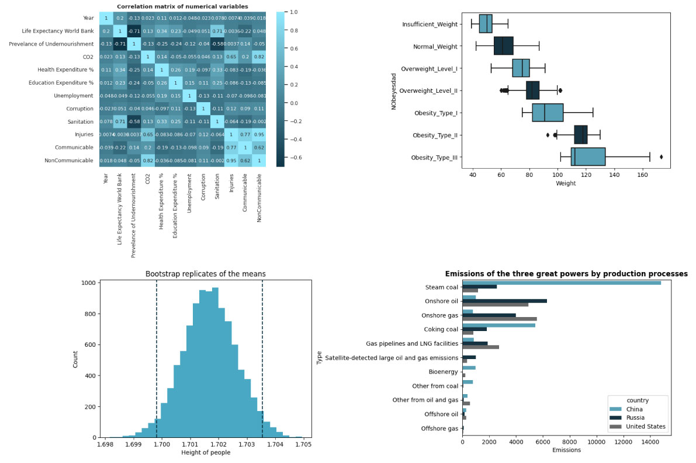

  

<h1 align="center">¡Hola! 😁
Soy William Correa  
¡Bienvenido a mi perfil de GitHub! </h1>

  
  
  
  
  

## Un poco acerca de mi

👋 ¡Hola! Soy un Data Analyst con más de 4 años de experiencia en el análisis y visualización de datos. Me apasiona desentrañar información clave y KPIs para impulsar estrategias fundamentadas en datos. Desde la implementación técnica de análisis 📊 hasta la construcción de dashboards en Power BI, Looker y Excel 📈, he logrado comunicar tendencias y oportunidades de manera efectiva.

He liderado la transformación y limpieza de datos 🧹, integrando grandes volúmenes de información de sell-out, sell-in e inventarios, y utilizando SQL/MySQL para extraer insights relevantes. También he participado en la automatización de reportes críticos (comisiones, headcount, KPIs de campo), la proyección de objetivos de ventas y el diseño de modelos de optimización 🚀.

Mis logros incluyen generar insights valiosos que han desentrañado tendencias de mercado, optimizar procesos operativos y segmentar clientes con modelos de machine learning 🤖, facilitando decisiones estratégicas de alto impacto.

Soy curioso, proactivo y apasionado por la mejora continua 📚, siempre explorando nuevas formas de combinar análisis avanzado, optimización de procesos y storytelling de datos para aportar valor real a las organizaciones.

¡Gracias por visitar mi perfil!

## Proyectos ⚡

He llevado a cabo diversos proyectos de ciencia de datos que abarcan desde la construcción de modelos de arbol de decisiones y Random Forest para la detección de fraude con tarjetas de crédito hasta la creación de modelos predictivos de regresión lineal multivariable para predecir la esperanza de vida utilizando datos socioeconómicos de diferentes regiones, incluyendo la aplicación de técnicas de Estadística inferencial para analizar índices de obesidad basados en hábitos alimentarios y condición física.

Estos proyectos han involucrado análisis de datos, limpieza, visualización y la implementación de diversas bibliotecas y herramientas de ciencia de datos para obtener perspicaces conclusiones y modelos predictivos. Estoy entusiasmado por seguir explorando desafíos en el campo del análisis y ciencia de datos.
 Algunos de mis proyectos son:
 

* [Detección de fraude con tarjetas de crédito - Árbol de decisiones - Random Forest](https://github.com/William-CCS96/Credit-card-fraud-predictive-model-with_decision_tree_and_random_forest)
* [Diagnóstico de cáncer de mama - Regresión logística binomial](https://github.com/William-CCS96/binomial_logistic-regression_diagnostic_breast_cancer_isconsin)
* [Regresión lineal multivariable esperanza de vida y estatus socioeconómico](https://github.com/William-CCS96/linear_regression_life_expectancy_and_socioeconomic)
* [Análisis estadístico inferencial según índices de obesisdad](https://github.com/William-CCS96/inferential_statitics_obesity_dataset-introduction)
* [Visualización de datos de las emisiones de metano según regiones, países y sectores productivos.](https://github.com/William-CCS96/matplotlib_seaborn_libraries_global_methane_emissions)

  

<!--
**William-CCS96/William-CCS96** is a ✨ _special_ ✨ repository because its `README.md` (this file) appears on your GitHub profile.

Here are some ideas to get you started:

- 🔭 I’m currently working on ...
- 🌱 I’m currently learning ...
- 👯 I’m looking to collaborate on ...
- 🤔 I’m looking for help with ...
- 💬 Ask me about ...
- 📫 How to reach me: ...
- 😄 Pronouns: ...
- ⚡ Fun fact: ...
-->
